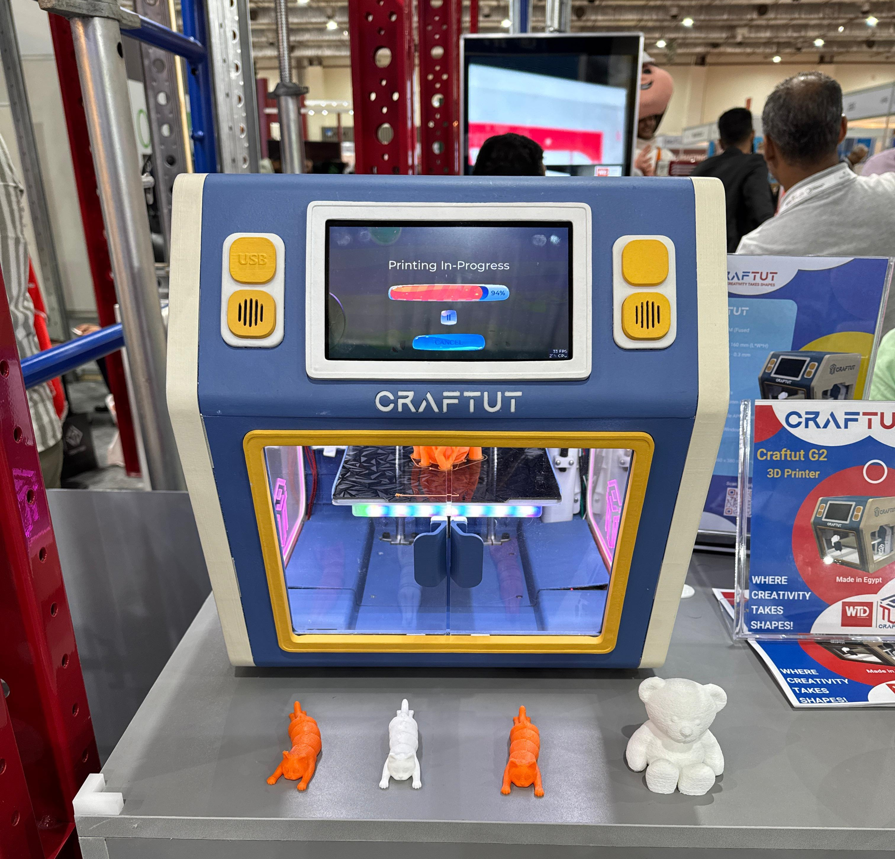
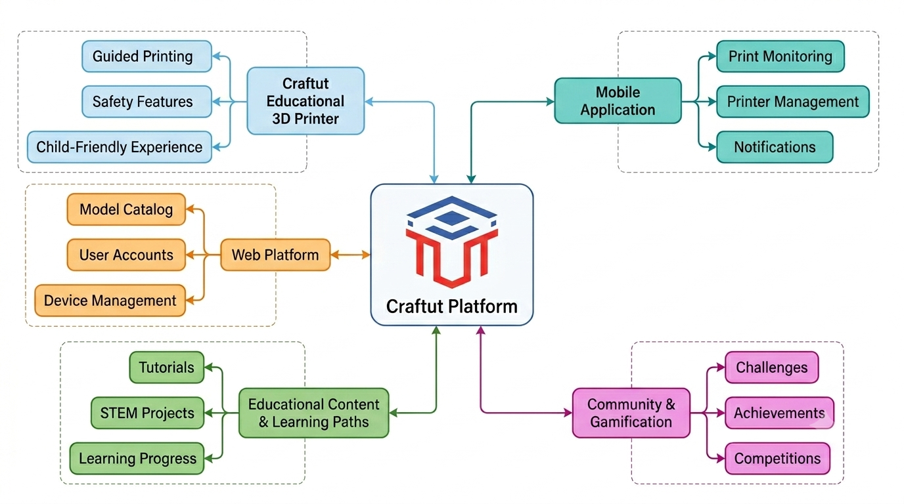
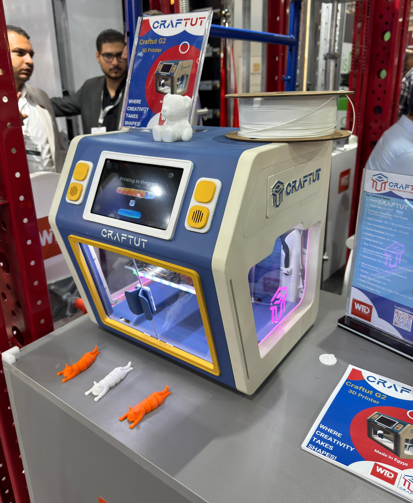
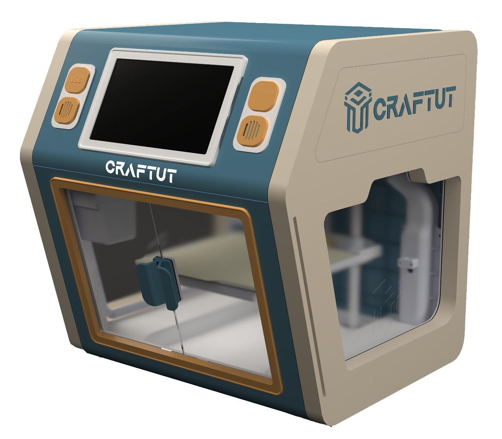
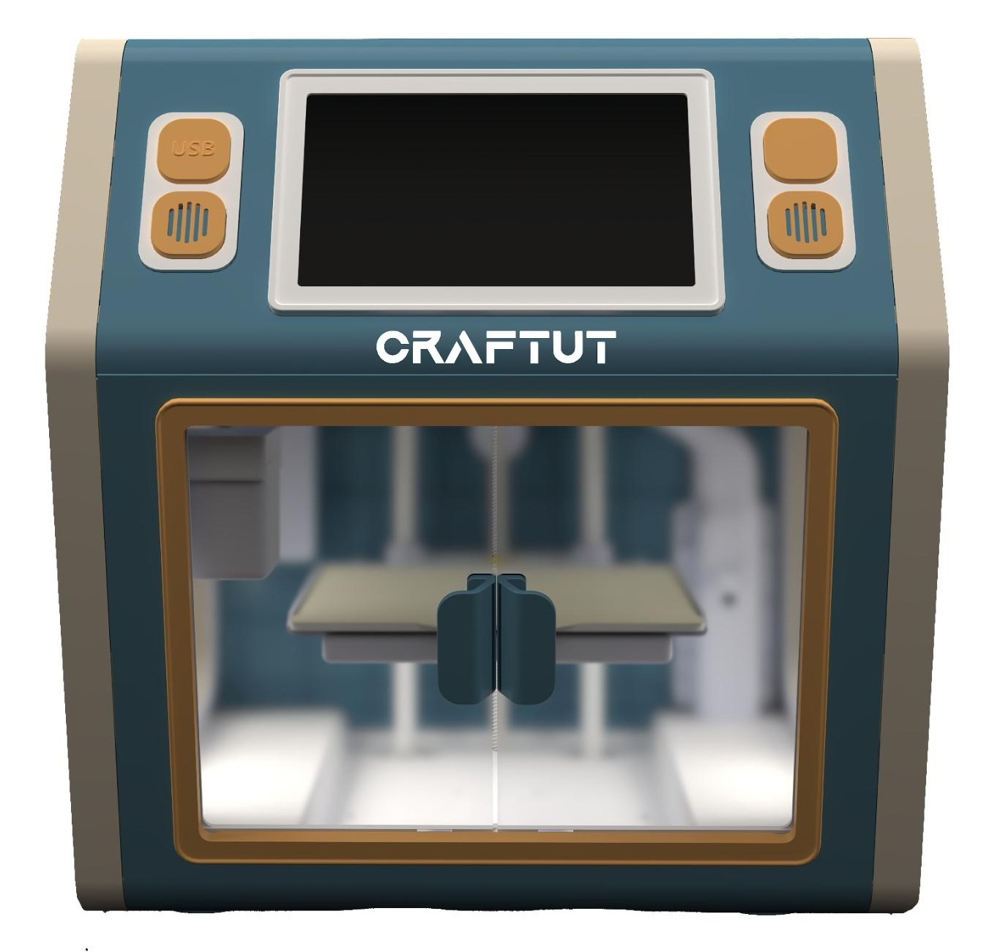
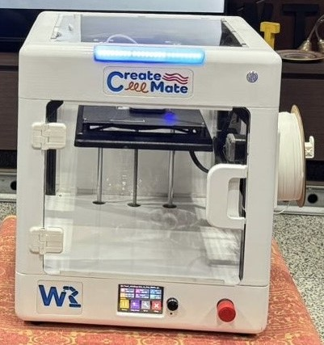
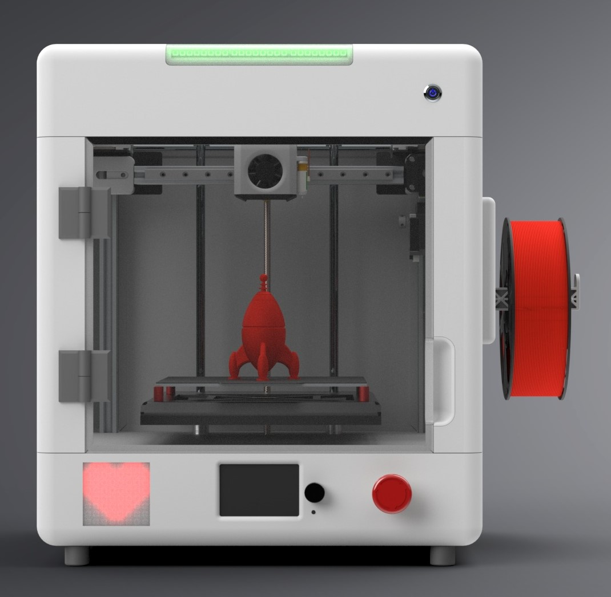
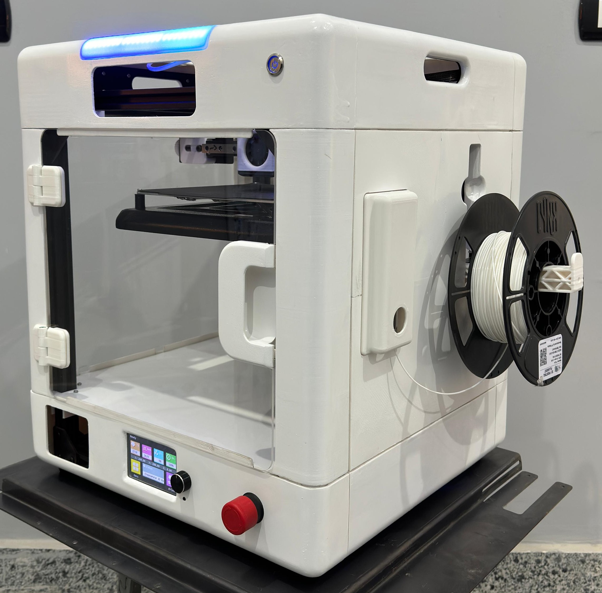
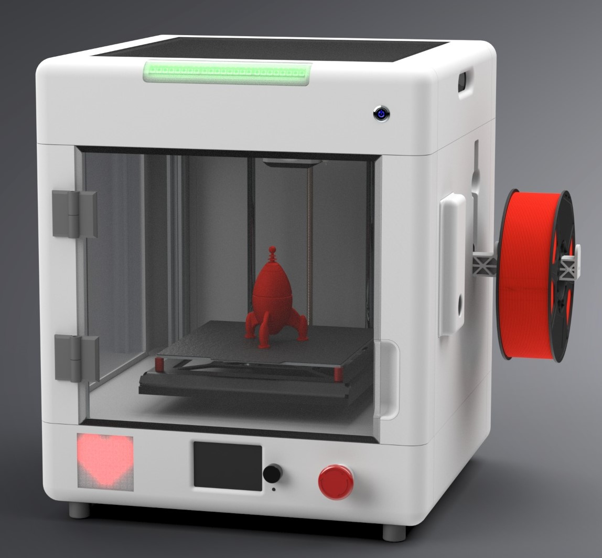

# Craftut — Educational 3D printing Platform

<!--
&gt; **Engineering Portfolio Repository**  
&gt; This repository documents the product development, systems engineering, and technical leadership behind Craftut, a child-focused educational 3D printing platform. It is intended for review by engineering hiring managers, technical leads, and R&D teams.
-->

---

## Repository Purpose

This repository showcases:

- Product development methodology
- Systems engineering and architecture decisions
- Robotics and mechatronics engineering
- Cross-functional technical leadership
- Engineering decision-making under constraint
- Documentation and technical communication

It is **not** marketing material. Claims are limited to validated outcomes or explicitly marked as unresolved.

---

## Engineering Honesty

This repository intentionally documents both achievements and unresolved engineering challenges. The objective is to present an accurate representation of the development process, design decisions, tradeoffs, lessons learned, and future opportunities rather than a polished success story.

Transparency and engineering credibility are prioritized throughout.

---

## Project Overview

Craftut is a child-focused educational additive manufacturing platform. The first product is a purpose-built educational 3D printer designed for children, families, educators, schools, and STEM learning environments.

The goal was not simply to build another 3D printer. The goal was to simplify additive manufacturing and transform it into a guided educational experience accessible to first-time users and children.

**Long-term platform vision:**

1. Child-safe 3D printer
2. Connected software ecosystem
3. Educational content and learning pathways
4. Community and gamification features
5. Project kits and STEM experiences

The printer serves as the entry point into this broader ecosystem.

---

## Repository Structure

| Document | Contents |
|----------|----------|
| [docs/Product_Vision.md](docs/Product_Vision.md) | Market origin, user definition, product requirements |
| [docs/Development_Process.md](docs/Development_Process.md) | Timeline, team, prototype evolution, role definition |
| [docs/System_Architecture.md](docs/System_Architecture.md) | Mechanical, electronics, software, safety, and UX architecture |
| [docs/Validation_and_Lessons_Learned.md](docs/Validation_and_Lessons_Learned.md) | Public demonstration, observed outcomes, challenges, lessons |
| [docs/Future_Roadmap.md](docs/Future_Roadmap.md) | Short, mid, and long-term development priorities |

---

## Current Status

The project is undergoing design revisions and improvements based on lessons learned and identified limitations from the exhibition MVP. It remains an active engineering effort.

---

## Contact

**Abdelaziz Elmasry**  
Co-Founder & Technical Lead, Alex Dynamics  
Alexandria, Egypt

- LinkedIn: [linkedin.com/in/abdelaziz-elmasry-07051997](https://linkedin.com/in/abdelaziz-elmasry-07051997)
- Email: [Abdelaziz.Ahmed.Elmasry@gmail.com](mailto:Abdelaziz.Ahmed.Elmasry@gmail.com)
<!-- - Portfolio: [github.com/AbdelazizElmasry/portfolio](https://github.com/AbdelazizElmasry/portfolio) -->

---

---

---

<!--
## Placeholder Inventory

&gt; Placeholder – Product photos (industrial design, exterior render)  
&gt; Placeholder – Prototype photos (Version 1, internal structure)  
&gt; Placeholder – MVP photos (exhibition unit, exterior and interior)  
&gt; Placeholder – UI screenshots (touchscreen interface, guided workflows)  
&gt; Placeholder – Architecture diagrams (system block diagram, data flow)  
&gt; Placeholder – Internal renders (mechanical assembly, motion system)  
&gt; Placeholder – Exhibition photos (Big 5 Construct Egypt, June 2025)  
&gt; Placeholder – Validation evidence (test logs, observation notes)

---
-->
*Repository maintained by the Product Development Lead.*
